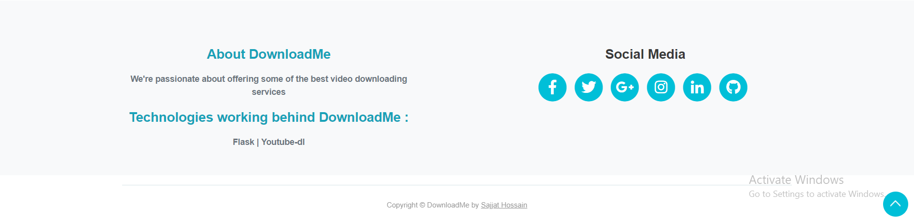

## Flask-Video-Downloader | Facebook Download Available

**[Youtube Downloading is Currently In Development State]()**

## Technologies Used :

- Flask
- Youtube-dl

##[Website Images]()

**Screenshot 1**


**Screenshot 2 : [Enter Your Link Here]()**


**Screenshot 3**


##[Requirements to use the source code :]()
**You can use [Virtual Environment]() : It must be installed in the project root directory**
**Run the given command to create [virtual env]() and run it**

```
# Create Virtual Environment : For windows users
py -m venv envName

# Run your virtual Environment :
source ./env/Scripts/activate

or in some cases :
./env/Scripts/activate

# Deactivate virtual env :
deactivate
```

**Install all [dependencies]() from the [requirments.txt](requirements.txt) file :**
#####Venv must be actvated as long the programme runs if you wish to use venv

```
# First goto to the project directory :
cd directoryName

# Install dependencies :
pip install -r requirments.txt
```

**Now you are ready to use the programme on your [Local Machine]()**
**To [run it]() type the given command**

```
# Use python3 if you are using mac or linux or older version of python :
python app.py
```

### Please let me know if there is/are [any room for improvement(s)](). If you like [my project]() please give it star. [Thank You.]()
