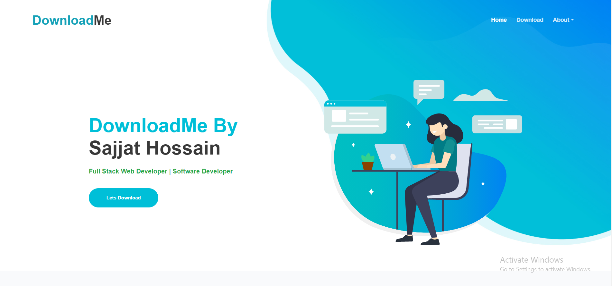
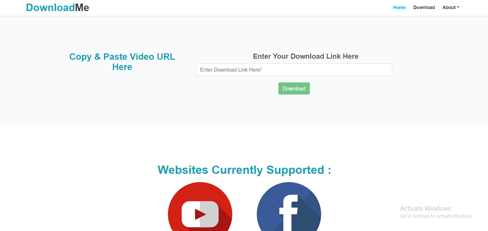

## Flask-Video-Downloader | [Facebook Download Available](https://silent-rebel-mass.glitch.me/)

**[Youtube Downloading is Currently In Development State]()**

<hr>

## Technologies Used :


**[Youtube-dl]()**

## [Website Image]()




## [Requirements to use the source code :]()

**You can use [Virtual Environment]() : It must be installed in the project root directory**

##### [Venv]() must stay active as long as the programme runs if you wish to use it

**Run the given command to create [virtual env]() and run it**

```
# Create Virtual Environment : For windows users
py -m venv envName

# Run your virtual Environment :
source ./envName/Scripts/activate

or in some cases :
./envName/Scripts/activate

# Deactivate virtual env :
deactivate

```

**Install all [dependencies]() from the [requirments.txt](requirements.txt) file : Use [pip3]() if have python 2 and 3 both installed**

```
# First goto to the project directory :
cd directoryName

# Install dependencies :
pip install -r requirments.txt

```

**Now you are ready to use the programme on your [Local Machine]()**
**To [run it]() type the given command**

```
# Use python3 if have python 2 and 3 both installed:
python app.py

```

### Please let me know if there is/are [any room for improvement(s)](). If you like [my project]() please give it star. [Thank You.]()
